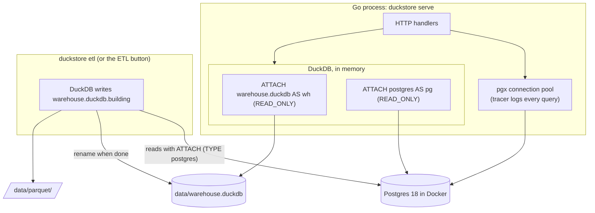

# OLTP vs OLAP, and how this project shares data

## Two workloads

**OLTP** (online transaction processing) is what an application does: show one product, add one item to a
cart, place one order. Each request touches a few rows, must be fast (milliseconds), and many run at the same time.
Correctness under concurrency matters most: two customers must not buy the last unit twice.

**OLAP** (online analytical processing) is what a report does: revenue per month for three years, retention
by cohort, return rate by brand. One question reads millions of rows but only a few columns, and nobody else
is changing those rows while it runs.

## Why the storage layout decides

```
Row store (Postgres, SQL Server rowstore)        Column store (DuckDB, SQL Server columnstore)

page 1: [id|customer|status|total|placed_at…]    id:        [1][2][3][4][5][6]…   compressed
page 2: [id|customer|status|total|placed_at…]    customer:  [7][3][7][9][1][3]…   compressed
page 3: [id|customer|status|total|placed_at…]    total:     [..][..][..][..]…     compressed
```

- To **fetch order 42**, the row store follows a B-tree to one page that holds the whole row. The column store
  has to find position 42 in each column it needs.
- To **sum `total` over 2.5M orders**, the row store reads every page, with all columns. The column store reads
  one compressed column, a few thousand values at a time, on every core.

That is the whole story behind the engine race results in the [README](../README.md#results-on-a-laptop).

## The pieces of this project



### The ETL: build a new file, then swap

`internal/warehouse/etl.go` runs four SQL files (`internal/warehouse/etl/`):

1. **Extract**: `CREATE TABLE raw.orders AS FROM pg.store.orders WHERE id <= <watermark>` for every table.
   DuckDB pulls the rows from Postgres with the binary COPY protocol over several connections.
2. **Dimensions**: `dim_date` (generated), `dim_category` (recursive CTE, path as a list), `dim_product`
   (SCD Type 2 from the price history), `dim_employee` (management chain as a list), `dim_customer`
   (referral depth), `dim_warehouse`, `dim_promotion`.
3. **Facts**: `fact_orders`, `fact_sales`, `fact_returns`, `fact_reviews`, `fact_inventory`. Money is converted
   to USD with an `ASOF JOIN` on the exchange rates, and each sale points to the product version valid at the
   time (`product_key`). Tables are written `ORDER BY` date so zone maps work.
4. **Marts**: `product_pairs` ("frequently bought together") and `product_stats`, read by the store pages.

Then it exports Parquet files, writes `dw.etl_info` and `dw.etl_steps`, and **renames** the new file over the old one.

Design decisions:

- **Watermark.** The highest order id is read first and every order table is filtered by it. Orders placed
  during the ETL wait for the next run, so the warehouse never holds half an order. The number is written into
  the SQL as a literal so DuckDB can push the filter down to Postgres.
- **Full rebuild.** Rebuilding everything takes about 13 seconds for 14M rows, which is simpler than incremental
  loads. At a larger scale you would load only new orders (by watermark) and use `MERGE INTO` for changed rows.
- **Build and swap.** DuckDB allows one writer per file. The ETL writes a different file that nobody reads,
  then `rename` replaces the old one atomically. Readers never see a half-built warehouse, and a failed ETL
  leaves the current warehouse untouched.
- **Readers reload.** The server attaches the warehouse `READ_ONLY` and checks every few seconds whether the
  file changed. When it did, it opens the new file, waits for running queries on the old one, and closes it.

### Sharing a DuckDB database: the four patterns

| Pattern | How | Used here |
|---|---|---|
| **1. One process owns the file** | An API server opens the file; users go through the API | Yes: `duckstore serve` |
| **2. Read-only file, rebuilt on a schedule** | A job builds a new file and swaps it; readers open it `READ_ONLY` | Yes: the ETL |
| **3. Shared Parquet files** | Export Parquet to a folder or S3; every user queries it with their own DuckDB | Yes: `data/parquet`, lesson 07 |
| **4. A managed service** | MotherDuck (hosted DuckDB), or DuckLake (catalog in Postgres, data in Parquet) for many writers | No |

What does **not** work: putting a `.duckdb` file on a network share (SMB/NFS) and opening it for writing from
several machines. File locks are not reliable there.

### Hybrid queries: fresh data without an OLTP load

The analytics side attaches Postgres too, so one DuckDB query can combine the warehouse (history, up to the
last ETL) with live Postgres rows (everything after the watermark). The dashboard's "orders since the last ETL"
and lesson 09 do this. It is cheap when the filter on Postgres is selective and pushed down.

The store does the reverse: the product page asks DuckDB **which** products are bought together (heavy,
pre-computed) and asks Postgres for their **current** names and prices (fresh, by primary key).

### Concurrency rules to remember

| | Postgres | DuckDB |
|---|---|---|
| Many processes writing | Yes | No: one process holds the write lock on the file |
| Many processes reading | Yes | Yes, if all open the file `READ_ONLY` and nobody writes |
| Two transactions update the same row | The second **waits** for the row lock | The second **fails** with a conflict; retry it |
| Long read during writes | MVCC snapshot | MVCC snapshot |

The checkout in `internal/web/checkout.go` shows the Postgres side: it locks the cart row, then locks stock rows
`ORDER BY warehouse_id, product_id` so two checkouts always take locks in the same order and cannot deadlock.
The "8 concurrent writers" race shows the DuckDB side.
