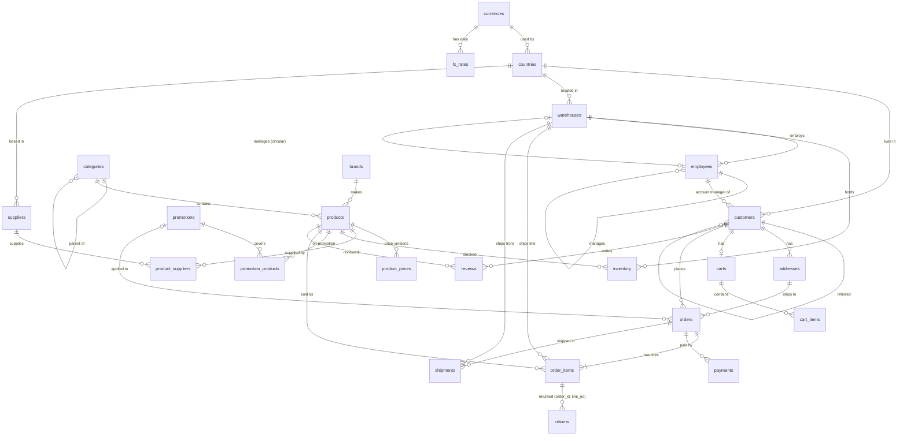
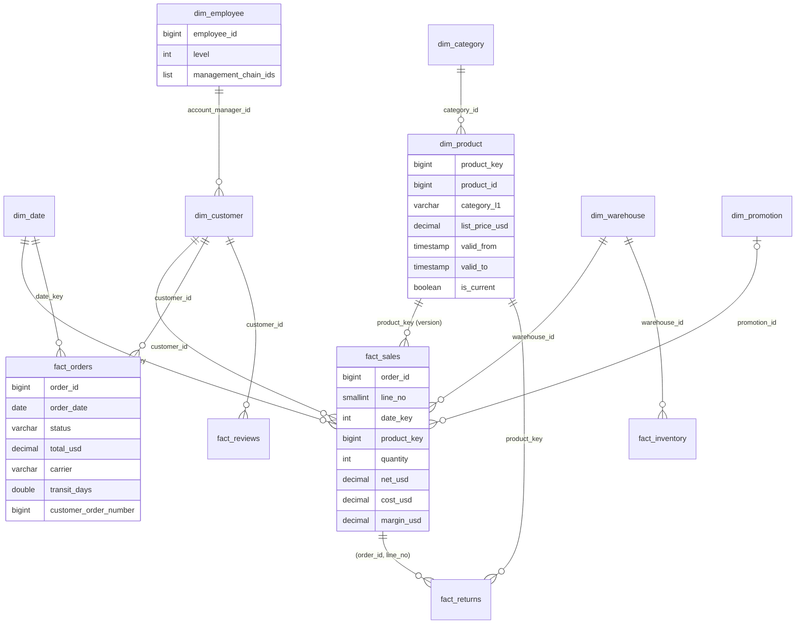

# The data model

## The store (Postgres, schema `store`)

A normalized model for the application. Files: [01_tables.sql](../internal/pg/schema/01_tables.sql) and
[02_constraints.sql](../internal/pg/schema/02_constraints.sql).

Relational features worth noticing:

| Feature | Where |
|---|---|
| Self-referencing hierarchies | `categories.parent_id` (tree of 2-4 levels), `employees.manager_id` (6 levels), `customers.referred_by_customer_id` (chains) |
| Circular foreign keys | `warehouses.manager_employee_id` ↔ `employees.warehouse_id` |
| Many-to-many with attributes | `product_suppliers` (cost, lead time, primary), `promotion_products` |
| Composite primary keys | `order_items (order_id, line_no)`, `inventory (warehouse_id, product_id)`, `fx_rates (currency_code, rate_date)` |
| Composite foreign key | `returns (order_id, line_no)` → `order_items` |
| Temporal table | `product_prices (valid_from, valid_to)`, with a filtered unique index allowing one open version per product |
| Business rules as constraints | `CHECK (total = subtotal - discount + shipping_fee + tax)`, status lists, shipment state consistency |
| Semi-structured data | `products.attributes jsonb` |
| One cart per customer | `UNIQUE (customer_id)`, used by `INSERT ... ON CONFLICT` |

Money in `orders`, `order_items`, `payments` and `returns` is in the **order's currency**. Converting to USD
needs the exchange rate of the order date, and exchange rates only exist for business days.

## The warehouse (DuckDB, schemas `raw` and `dw`)

`raw.*` holds untouched copies of the store tables (used by the race to compare engines on the same model).
`dw.*` is a star schema built by [the ETL](../etl/).

| Table | Grain | Built with |
|---|---|---|
| `fact_sales` | one order line (cancelled orders excluded) | SCD2 range join to `dim_product`, USD via `fact_orders` |
| `fact_orders` | one order | `ASOF JOIN` to exchange rates, `arg_max` for the last payment, `row_number()` for the customer's order number |
| `fact_returns`, `fact_reviews` | one return, one review | |
| `fact_inventory` | warehouse × product, at ETL time | a snapshot |
| `dim_product` | one row per price version | Type 2 slowly changing dimension from `product_prices` |
| `dim_category` | one row per category, with its full path | recursive CTE carrying a `LIST` |
| `dim_employee` | one row per employee, with the chain of managers | recursive CTE carrying a `LIST` of ids |
| `dim_customer` | one row per customer (Type 1) | recursive CTE for referral depth |
| `dim_date` | one row per day | `generate_series` |
| `product_pairs`, `product_stats` | marts for the store pages | self-join of `fact_sales`, `QUALIFY` |
