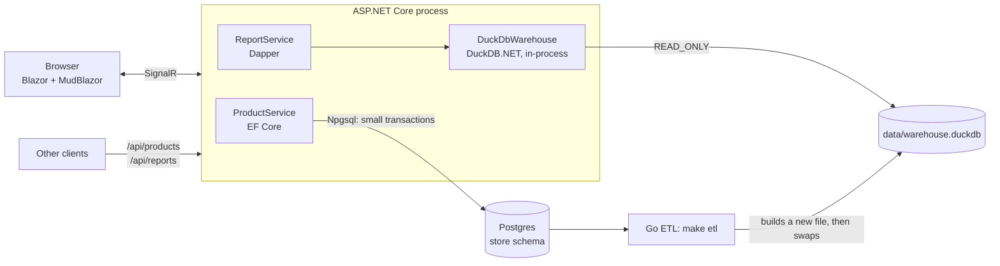

# DuckStore for .NET

The same store as the Go project, as one **ASP.NET Core** app in C#:

- **Products (CRUD)** on **Postgres** with **EF Core**: search, sort, paging, create, edit, delete.
- **Reports** on the **DuckDB** warehouse with **DuckDB.NET + Dapper** and plain SQL.
- **UI** with **Blazor** (interactive server rendering) and **MudBlazor** components: C# only, no JavaScript framework.
- **REST API** at `/api/...` over the same services, documented with OpenAPI and **Scalar** at `/scalar`.

It uses the same Postgres database and the same `data/warehouse.duckdb` file as the Go app, so both can run at the same time.



## Run it

From the `duckstore` folder (Postgres running, data loaded, warehouse built: `make up seed etl`):

```bash
make dotnet-run     # http://127.0.0.1:5085       (UI)
                    # http://127.0.0.1:5085/scalar (API reference)
make dotnet-test    # integration tests against the real Postgres and DuckDB
```

Or from this folder: `dotnet run --project src/DuckStore.Web` and `dotnet test`.
Requires the .NET 10 SDK. In Development, EF Core prints every SQL statement it runs to the terminal.

## The code

```
src/DuckStore.Web/
  Program.cs                   services and endpoints
  Data/StoreDbContext.cs       EF Core mapping of the existing Postgres tables (no migrations)
  Services/ProductService.cs   CRUD + business rules (price versions, delete guard)
  Warehouse/DuckDbWarehouse.cs opens the DuckDB file read-only, reopens it after an ETL
  Warehouse/ReportService.cs   report SQL (the same SQL as the Go dashboard)
  Api/                         minimal API endpoints and error mapping (ProblemDetails)
  Components/Pages/            Home, Products, ProductDialog, Reports
tests/DuckStore.Tests/         WebApplicationFactory tests over the real databases
```

Design decisions worth reading in the code:

| Decision | Why |
|---|---|
| EF Core for CRUD, Dapper for reports | EF Core shines at loading and saving entities. Reports are SQL written by hand for DuckDB (PIVOT, QUALIFY, ASOF), so a thin mapper is better. |
| `IDbContextFactory`, one DbContext per operation | In Blazor Server a scoped service lives as long as the browser tab; one DbContext must not serve overlapping operations. |
| A price change = close the current `product_prices` row + insert a new one, in one `SaveChanges` | Keeps the history the warehouse turns into a Type 2 slowly changing dimension. |
| Delete refuses sold products (409) | Order history must survive. Deactivate instead. |
| One in-memory DuckDB with the file attached `READ_ONLY`, a `Duplicate()` connection per query | Opening the file costs ~13 ms, a duplicate ~0.4 ms. Read-only lets the Go app and the ETL work at the same time. |
| Reopen when the file changes | The ETL writes a new file and renames it. The next query opens the new file; queries on the old one finish normally. |
| `Warehouse:Threads` = 8 | DuckDB uses every core by default. In a web process that also serves CRUD requests, keep some cores free. |
| Casts in report SQL (`::BIGINT`, `::DECIMAL`) | DuckDB `sum()` of integers returns HUGEINT (`BigInteger` in .NET), and division returns DOUBLE. |

## One backend or two?

**Short answer: one.** For this project, the ASP.NET Core app can be the only backend. It serves the CRUD
screens, the reports and the API. There is no need to keep the Go web server as well.

Why that works: DuckDB is a **library**, not a server. The query runs inside DuckDB's C++ engine in both cases;
Go or C# only sends the SQL and reads the rows. On this laptop the monthly revenue report took 60-90 ms from
either app, and the SQL is the same apart from a few type casts for .NET. So choose the language your team knows and maintains: for a SQL Server / .NET team, that is C#.

What still makes sense to keep separate:

| Piece | Recommendation |
|---|---|
| CRUD API + UI | The ASP.NET Core app |
| Report endpoints | **Same app**, different endpoints (`/api/reports/*`), as here |
| ETL (Postgres → DuckDB) | A **separate batch job** in any language, on a schedule. It is a script of SQL files ([internal/warehouse/etl](../internal/warehouse/etl/)), so a C# `BackgroundService` or a console app could run the same files. Here the Go ETL is reused. |

When a **separate reporting service** starts to pay off:

- Reports use so much CPU or memory that CRUD requests slow down, even with `threads` limited.
- Reports need to scale on different machines than the API (many analysts, few store writes).
- A different team owns the analytics.

Rules that apply in every case:

1. **Only one process writes the DuckDB file**, and here that is the ETL, writing a new file and swapping it.
   The web apps (Go, C#, or both) open it `READ_ONLY`.
2. **Never write orders into DuckDB** from the web app. Writes go to Postgres; DuckDB gets them from the next ETL.
3. For **"right now" numbers**, ask Postgres (as the status card does), or combine the warehouse with a
   small live Postgres query.
