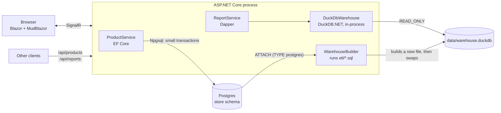

# DuckStore for .NET

The same store as the Go project, as one **ASP.NET Core** app in C#:

- **Products (CRUD)** on **Postgres** with **EF Core**: search, sort, paging, create, edit, delete.
- **Reports** on the **DuckDB** warehouse with **DuckDB.NET + Dapper** and plain SQL.
- **UI** with **Blazor** (interactive server rendering) and **MudBlazor** components: C# only, no JavaScript framework.
- **ETL** (Postgres → DuckDB) in C#: runs the SQL files in [etl/](../etl/) from the ETL page, the API, a schedule or the command line.
- **REST API** at `/api/...` over the same services, documented with OpenAPI and **Scalar** at `/scalar`.

It uses the same Postgres database and the same `data/warehouse.duckdb` file as the Go app, so both can run at the same time.
Go is only needed once, to create the fake store data (`make seed`).



## Run it

From the `duckstore` folder:

```bash
make up             # Postgres in Docker
make seed           # the fake store data (the only step that uses Go)
make dotnet-etl     # build the DuckDB warehouse with the C# ETL (about 13 s)
make dotnet-run     # http://127.0.0.1:5085       (UI, the ETL page is at /etl)
                    # http://127.0.0.1:5085/scalar (API reference)
make dotnet-test    # tests against the real Postgres and DuckDB
```

Or from this folder: `dotnet run --project src/DuckStore.Web [-- etl]` and `dotnet test`.
Requires the .NET 10 SDK. In Development, EF Core prints every SQL statement it runs to the terminal.

## The code

```
src/DuckStore.Web/
  Program.cs                   services and endpoints
  Data/StoreDbContext.cs       EF Core mapping of the existing Postgres tables (no migrations)
  Services/ProductService.cs   CRUD + business rules (price versions, delete guard)
  Warehouse/DuckDbWarehouse.cs opens the DuckDB file read-only, reopens it after an ETL
  Warehouse/ReportService.cs   report SQL (the same SQL as the Go dashboard)
  Etl/WarehouseBuilder.cs      the ETL: lock, new file, ATTACH postgres, run etl/*.sql, Parquet, swap
  Etl/EtlService.cs            runs it in the background for the ETL page, the API and the schedule
  Etl/SqlScript.cs             splits the SQL files into statements
  Api/                         minimal API endpoints and error mapping (ProblemDetails)
  Components/Pages/            Home, Products, ProductDialog, Reports
tests/DuckStore.Tests/         WebApplicationFactory tests over the real databases
```

Design decisions worth reading in the code:

| Decision | Why |
|---|---|
| EF Core for CRUD, Dapper for reports | EF Core shines at loading and saving entities. Reports are SQL written by hand for DuckDB (PIVOT, QUALIFY, ASOF), so a thin mapper is better. |
| `IDbContextFactory`, one DbContext per operation | In Blazor Server a scoped service lives as long as the browser tab; one DbContext must not serve overlapping operations. |
| A price change = close the current `product_prices` row + insert a new one, in one `SaveChanges` | Keeps the history the warehouse turns into a Type 2 slowly changing dimension. |
| Delete refuses sold products (409) | Order history must survive. Deactivate instead. |
| One in-memory DuckDB with the file attached `READ_ONLY`, a `Duplicate()` connection per query | Opening the file costs ~13 ms, a duplicate ~0.4 ms. Read-only lets the Go app and the ETL work at the same time. |
| Reopen when the file changes | The ETL writes a new file and renames it. The next query opens the new file; queries on the old one finish normally. |
| `Warehouse:Threads` = 8 | DuckDB uses every core by default. In a web process that also serves CRUD requests, keep some cores free. |
| Casts in report SQL (`::BIGINT`, `::DECIMAL`) | DuckDB `sum()` of integers returns HUGEINT (`BigInteger` in .NET), and division returns DOUBLE. |
| ETL SQL embedded from the top-level `etl/` folder | One copy of the SQL for every runner. The C# code only handles what SQL cannot: the lock, the files, the swap. |
| ETL writes `warehouse.duckdb.building`, then `File.Move(..., overwrite: true)` | DuckDB allows one writer per file. The reports never see a half-built warehouse, and a failed ETL leaves the old one in place. |
| Lock file `data/etl.lock` opened with `FileShare.None` | On Linux/macOS that is an exclusive `flock()`, the same lock the Go ETL takes, so two ETLs can never run at once (tested). |
| Watermark as a literal in the SQL | The highest order id is read first; a literal (not a subquery) lets DuckDB push the filter down to Postgres. |

## One backend or two?

**One.** The ASP.NET Core app is the whole backend: CRUD screens, reports, the API and the ETL.
Go is no longer needed to run it; it is only used once to generate the fake data (`make seed`).

Why one is enough: DuckDB is a **library**, not a server. The query runs inside DuckDB's C++ engine whichever
language calls it; Go or C# only sends SQL and reads rows. On this laptop the monthly revenue report took
60-90 ms from either app, and the C# ETL builds the warehouse in 12-13 s, like the Go ETL, with the same 41
steps and the same row counts. So choose the language your team knows: for a SQL Server / .NET team, C#.

How the pieces are split inside the one app:

| Piece | Where |
|---|---|
| CRUD API + UI | `ProductService`, Postgres |
| Reports | `ReportService`, the DuckDB file, separate endpoints (`/api/reports/*`) |
| ETL | `WarehouseBuilder`: the ETL page, `POST /api/etl/runs`, `Etl:ScheduleMinutes`, or `dotnet DuckStore.Web.dll etl` from cron |

When to split into more processes later:

- **The ETL** is the first candidate: run `DuckStore.Web.dll etl` as a scheduled job (cron, Kubernetes CronJob,
  Azure Container Apps job) instead of inside the web process, so a 13-second, all-cores build never competes
  with web requests. When you deploy, set `Warehouse__Path` (and `ConnectionStrings__Store`) as environment
  variables with absolute paths; the default path in appsettings.json is relative to the project folder.
- **A reporting service** pays off when reports slow down CRUD requests even with `Warehouse:Threads` limited,
  need to scale on different machines, or belong to a different team.

Rules that apply in every case:

1. **Only one process writes the DuckDB file**, and that is the ETL, writing a new file and swapping it.
   Everything else opens it `READ_ONLY`.
2. **Never write orders into DuckDB** from the web app. Writes go to Postgres; DuckDB gets them from the next ETL.
3. For **"right now" numbers**, ask Postgres (as the status card does), or combine the warehouse with a
   small live Postgres query.
