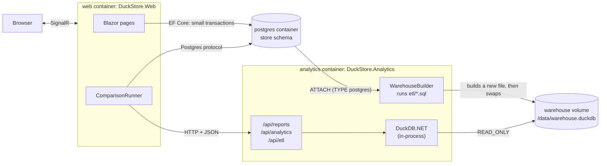

# DuckStore for .NET

The same store as the Go project, in C#, as **two ASP.NET Core services** that look like one application:

| Project | What it does | Talks to |
|---|---|---|
| `DuckStore.Web` | Blazor + MudBlazor UI: **Products** (CRUD), **Reports**, **ETL** and **Compare** pages; product REST API | Postgres (EF Core, Npgsql) and the analytics service (HTTP) |
| `DuckStore.Analytics` | Owns the **DuckDB** warehouse file: ETL, reports API, analytics API | DuckDB (inside the process); Postgres only during the ETL |
| `DuckStore.Contracts` | The records both services exchange as JSON | |

For the user it is one application. Underneath, each part runs where it works best, and the **Compare** page
runs the same 15 questions both ways so you can see what each way costs.



## Run it

### Everything in Docker

You only need Docker. From the `duckstore` folder:

```bash
make docker-up      # build and start postgres, analytics and web
make docker-seed    # load the fake store data (SCALE=5 by default) and build the warehouse
```

Then open:

- http://127.0.0.1:5085/compare: the Compare page (http://127.0.0.1:5085 for the rest of the app)
- http://127.0.0.1:5085/scalar and http://127.0.0.1:5090/scalar: API references of the two services

Without `make`:

```bash
docker compose up -d --build
docker compose run --rm seed -scale 5                # the seed image is a small Go binary; no Go install needed
docker compose run --rm --no-deps analytics etl      # or press "Run ETL now" on the ETL page
```

On the test laptop, scale 5 (12.5M orders, 26.5M order lines) took about **3 minutes** to seed (about 10 GB
in Postgres) and **68 seconds** to build the warehouse (a 2.6 GB DuckDB file). `make docker-seed SCALE=1`
is five times smaller.

Other commands:

```bash
make docker-compare   # the Compare questions in the terminal (see below)
make docker-etl       # rebuild the warehouse; the running service switches to the new file
make docker-logs      # follow the analytics and web logs
make down             # stop the containers (data stays in the volumes)
make reset            # stop and delete all data
```

**Memory.** All three containers share one machine. On a 28 GB laptop with a desktop open, Postgres gets
`shared_buffers=3GB` and DuckDB `memory_limit=6GB` (`Warehouse__MemoryLimit`), both in `docker-compose.yml`.
With larger values the seed's index build ran the machine low on memory. `memory_limit` is DuckDB's
version of SQL Server's "max server memory": without it, DuckDB may use 80% of the RAM.

### Locally, for development

Requires the .NET 10 SDK. Postgres still runs in Docker.

```bash
make up                  # only Postgres in Docker
make seed                # fake data with Go, or: docker compose run --rm seed -scale 1
make dotnet-etl          # build data/warehouse.duckdb with the C# ETL
make dotnet-analytics    # http://127.0.0.1:5090
make dotnet-run          # http://127.0.0.1:5085 (in another terminal)
make dotnet-test         # tests against the real Postgres and DuckDB
```

The local apps use the same ports as the containers: stop those first with `docker compose stop web analytics`.
In Development, EF Core prints every SQL statement it runs to the terminal.

## The Compare page

Each question runs two ways:

- **Postgres direct**: the web app sends SQL to Postgres over the Postgres protocol, on the normalized store tables.
- **DuckDB service**: the web app sends an HTTP request to the analytics service, which runs SQL on its DuckDB
  file (star schema) and returns the rows as JSON.

The two answers must be equal, so the Postgres SQL only counts orders up to the warehouse **watermark** (the
last order id the ETL copied). The page compares both results row by row, with a tolerance of one cent for money.

**Measuring.** One run can be unlucky: a cold cache, or another program busy for a moment. Choose a warm-up
run and 3-7 timed runs, and the page shows the **median** run (half of the runs were faster, half slower),
plus the fastest and the slowest. The two approaches take turns (Postgres, DuckDB, Postgres, ...), so a slow
moment on the machine hits both.

**Where the time goes.** Each run is split into phases:

| Phase | Postgres direct | DuckDB service |
|---|---|---|
| **Database** | From sending the query until the first row arrives. For a small result this is almost everything. | Measured inside the service: executing until the first row, then reading the other rows. |
| **Network** | Reading the other rows from the connection and decoding them. | The HTTP time seen by the web app minus the service's own phases (sent in a `Server-Timing` header). It includes the network, Kestrel and HttpClient. |
| **JSON** | None: the Postgres protocol is binary. | Serializing in the service plus parsing in the web app. |

### Results at scale 5

Median of 5 runs after 1 warm-up run; the fastest and slowest run in brackets. Measured with
`compare --runs 5 --warmup 1` inside the web container on an AMD Ryzen 7 5825U (8 cores / 16 threads), 28 GB RAM,
NVMe SSD, all three containers on the same laptop. Data: scale 5 = 1.5M customers, 150k products, 12.5M orders,
26.5M order lines. Postgres 18 with the settings in `docker-compose.yml` (up to 8 parallel workers per query),
DuckDB 1.5.5 with 16 threads and a 6 GB memory limit. All 15 results were equal on both sides.

| Question | Postgres direct | DuckDB service | Network + JSON inside the DuckDB time | Faster |
|---|---:|---:|---:|---|
| Year-over-year growth by department | 49.2 s (48.7-49.7) | 130 ms (129-141) | 1.7 ms | DuckDB, 378× |
| Unusual days | 2.04 s (2.00-2.10) | 7.5 ms (7.4-7.5) | 1.0 ms | DuckDB, 273× |
| Revenue per month | 36.5 s (35.8-38.3) | 277 ms (271-282) | 2.3 ms | DuckDB, 132× |
| Top 3 products per department | 26.5 s (26.2-26.5) | 419 ms (408-453) | 1.8 ms | DuckDB, 63× |
| Customer lifetime value buckets | 12.2 s (12.1-12.5) | 194 ms (192-201) | 1.1 ms | DuckDB, 63× |
| Revenue by sales leader | 7.65 s (7.55-7.69) | 142 ms (135-149) | 1.4 ms | DuckDB, 54× |
| Products bought together | 11.4 s (11.3-11.4) | 241 ms (236-245) | 2.9 ms | DuckDB, 47× |
| Cohort retention | 19.3 s (19.2-19.4) | 451 ms (443-474) | 2.2 ms | DuckDB, 43× |
| Delivery time percentiles | 12.9 s (12.8-13.2) | 308 ms (304-324) | 1.2 ms | DuckDB, 42× |
| RFM customer segments | 14.7 s (14.6-14.8) | 427 ms (404-431) | 1.8 ms | DuckDB, 35× |
| Revenue by category with subtotals | 62.5 s (62.1-62.7) | 2.52 s (2.44-2.65) | 2.3 ms | DuckDB, 25× |
| Return rate by brand | 4.62 s (4.59-4.63) | 230 ms (220-237) | 1.5 ms | DuckDB, 20× |
| Active customers per month | 2.96 s (2.93-3.06) | 209 ms (201-215) | 1.5 ms | DuckDB, 14× |
| All order lines of one day (42,581 rows, 4.1 MB of JSON) | 264 ms (247-310) | 283 ms (200-337) | 227 ms | about equal |
| One customer's latest orders (lookup by key) | **0.9 ms** (0.9-1.2) | 5.2 ms (4.6-7.2) | 0.8 ms | Postgres, 5.7× |

Every run is in [docs/results/compare-scale5.csv](../docs/results/compare-scale5.csv).

What the numbers say:

- **Analytics: DuckDB is 14-378× faster, even behind HTTP.** The service boundary (network plus JSON) costs
  1-3 ms per question, less than 1% of the DuckDB time and nothing next to the Postgres time.
- **But the gap mixes two things:** the **engine** (column store, vectorized, all cores) and the **data model**.
  Postgres converts every order line to USD with an exchange-rate calendar it builds in each query; the star
  schema has the USD amount ready, because the ETL did that work once. The Go engine race measures the two
  separately on 5 of these questions at scale 1 ([README](../README.md#analytics-scan-join-aggregate)): the
  engine alone gave 3-25×, the star schema another 2-15×.
- **Large results: the format decides, not the engine.** DuckDB found the 42,581 rows in 55 ms, then JSON took
  223 ms (serializing in the service, parsing in the web app). Postgres sent the same rows in its binary protocol
  in 44 ms. For big results, use a binary format (Arrow, Parquet) or keep the work next to the data.
- **Lookups by key: Postgres wins.** Its index finds one customer's orders in 0.9 ms. DuckDB needs 4.5 ms: the
  fact table is sorted by date, so zone maps cannot skip blocks for a customer, and DuckDB scans all 12.5M
  `customer_id` values on 16 threads. HTTP adds under 1 ms.
- **Repeat small measurements.** Most analytics runs were within a few percent of their median, but the lookup
  and the large result varied by up to 40% between runs. One run of those would be a guess.

Limits of this measurement: one machine, so the "network" is a Docker bridge, much faster than a real network,
and the containers share the same cores and memory; one user at a time; Postgres without partitioning, summary
tables or columnar storage.

### The same measurement in the terminal

```bash
make docker-compare
# or with options:
docker compose exec web dotnet DuckStore.Web.dll compare --runs 5 --warmup 1 --csv /tmp/runs.csv monthly-revenue customer-orders
```

`--csv` writes one row per run (warm-up runs too). DuckDB reads the file directly, so you can analyze the
benchmark with the engine you are learning:

```sql
SELECT question, approach,
       median(total_ms) AS median_ms, min(total_ms) AS fastest, max(total_ms) AS slowest
FROM 'runs.csv'
WHERE NOT warmup
GROUP BY ALL
ORDER BY question, approach;
```

## The code

```
src/DuckStore.Contracts/
  Analytics.cs                  the 15 Compare questions, request and result records
  Reports.cs, Etl.cs            report and ETL records
  Cells.cs                      one value format for both engines, and the "same result" rule
src/DuckStore.Analytics/        the analytics service
  Program.cs                    services, endpoints, `etl` and `install-extensions` commands
  Warehouse/DuckDbWarehouse.cs  opens the DuckDB file read-only, reopens it after an ETL
  Warehouse/ReportService.cs    report SQL (the same SQL as the Go dashboard)
  Analytics/AnalyticsRunner.cs  runs a question's SQL on DuckDB (store or star model) and times it
  Etl/StarToPostgres.cs         copies the star schema into Postgres (etl/postgres-star/)
  Etl/WarehouseBuilder.cs       the ETL: lock, new file, ATTACH postgres, run etl/*.sql, Parquet, swap
  Etl/EtlService.cs             runs it in the background for the ETL page, the API and the schedule
  Api/                          minimal API endpoints and error mapping (ProblemDetails)
src/DuckStore.Web/              the web app
  Data/StoreDbContext.cs        EF Core mapping of the existing Postgres tables (no migrations)
  Services/ProductService.cs    CRUD + business rules (price versions, delete guard)
  Services/AnalyticsApiClient.cs typed HttpClient for the analytics service
  Services/Comparison.cs        runs a question both ways, repeats, splits the time into phases
  Services/CompareCommand.cs    the terminal version of the Compare page
  Components/Pages/             Home, Products, Reports, Etl, Compare
tests/DuckStore.Web.Tests/      product API tests over the real Postgres
tests/DuckStore.Analytics.Tests/ ETL, lock, report and SQL splitter tests
../analytics/                   one folder per Compare question: store.sql, star.sql or star.<engine>.sql
../etl/                         the ETL SQL, shared with the Go version
../docker/                      Dockerfiles for seed, analytics and web
```

Design decisions worth reading in the code:

| Decision | Why |
|---|---|
| DuckDB lives only in the analytics service | One process owns the file, so there is one place for the ETL, the lock and the reopen logic. The web app has no DuckDB dependency and can be scaled or deployed on its own. The price is a network hop plus JSON on every call (measured on the Compare page). |
| A shared `Contracts` project | Both services compile against the same records, so a changed field breaks the build, not production. |
| `Server-Timing` header on analytics responses | The service reports its own execute, read and serialize times. The web app subtracts them from what it measured, so what is left is network and HTTP overhead. |
| One folder of SQL per Compare question ([analytics/README.md](../analytics/README.md)) | `store.sql` runs on both engines (DuckDB reads the ETL's `raw.*` copy), so the store tables isolate the engine. The star schema has `star.sql`, or one file per engine when the dialects differ. All versions return the same columns, so the results can be compared cell by cell. |
| Postgres SQL is bounded by the watermark | Postgres has orders that the warehouse does not have yet. Without the bound the answers would differ for the wrong reason. |
| EF Core for CRUD, Dapper for reports | EF Core shines at loading and saving entities. Reports are SQL written by hand for DuckDB (PIVOT, QUALIFY, ASOF), so a thin mapper is better. |
| `IDbContextFactory`, one DbContext per operation | In Blazor Server a scoped service lives as long as the browser tab; one DbContext must not serve overlapping operations. |
| A price change = close the current `product_prices` row + insert a new one, in one `SaveChanges` | Keeps the history the warehouse turns into a Type 2 slowly changing dimension. |
| Delete refuses sold products (409) | Order history must survive. Deactivate instead. |
| One in-memory DuckDB with the file attached `READ_ONLY`, a `Duplicate()` connection per query | Opening the file costs ~13 ms, a duplicate ~0.4 ms. Read-only lets the Go app and the ETL work at the same time. |
| Reopen when the file changes | The ETL writes a new file and renames it. The next query opens the new file; queries on the old one finish normally. |
| `Warehouse:MemoryLimit` and `Warehouse:Threads` | DuckDB takes 80% of the RAM and every core by default. Limit them when it shares the machine with Postgres. |
| Casts in report SQL (`::BIGINT`, `::DECIMAL`) | DuckDB `sum()` of integers returns HUGEINT (`BigInteger` in .NET), and division returns DOUBLE. |
| ETL SQL embedded from the top-level `etl/` folder | One copy of the SQL for every runner. The C# code only handles what SQL cannot: the lock, the files, the swap. |
| ETL writes `warehouse.duckdb.building`, then `File.Move(..., overwrite: true)` | DuckDB allows one writer per file. The reports never see a half-built warehouse, and a failed ETL leaves the old one in place. |
| Lock file `etl.lock` opened with `FileShare.None` | On Linux/macOS that is an exclusive `flock()`, the same lock the Go ETL takes, so two ETLs can never run at once (tested). |
| A failed startup or scheduled ETL is logged, not thrown | Otherwise an empty database at the first `docker compose up` would stop the analytics container. |
| The Docker image installs the `postgres` extension at build time | The container needs no internet access to run the ETL. |
| `RequiresAspNetWebAssets` in the web project | `blazor.web.js` comes from a NuGet package that the SDK adds only when it sees `.razor` files at restore time. The Dockerfile restores from the `.csproj` alone (for layer caching), so without this the pages load but nothing is interactive. |

## One backend or two?

**One is enough for most applications.** DuckDB is a library, not a server: the query runs inside DuckDB's C++
engine whichever process calls it, so moving it to another service does not make the query faster. Before
the split, this app ran CRUD, reports and the ETL in one process.

This project splits into two services **on purpose**, to measure what a service boundary costs. The Compare
page shows the price: a few milliseconds of HTTP per call, plus JSON time that grows with the number of rows.
Next to a 300 ms analytics query that is noise; next to a 1 ms lookup by key it is most of the time.

Split DuckDB into its own service when:

- **The ETL or heavy reports slow down the web requests.** DuckDB uses every core for one query.
- **Several applications** need the same warehouse, not only this web app.
- **It scales, deploys or belongs to a team differently** from the web app.

Keep it in one process when one application uses it, the results are small, and one deployment is simpler.

Rules that apply in every case:

1. **Only one process writes the DuckDB file**, and that is the ETL, writing a new file and swapping it.
   Everything else opens it `READ_ONLY`.
2. **Never write orders into DuckDB** from the web app. Writes go to Postgres; DuckDB gets them from the next ETL.
3. **Keep lookups by key on Postgres.** An index finds one customer's orders in about 1 ms; the service path is
   slower before the query even starts.
4. For **"right now" numbers**, ask Postgres (as the Home page does for orders after the watermark), or combine
   the warehouse with a small live Postgres query.
