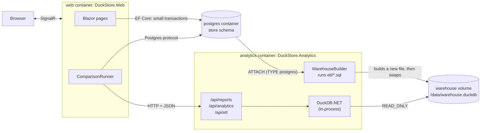

# DuckStore for .NET

The same store as the Go project, in C#, as **two ASP.NET Core services** that look like one application:

| Project | What it does | Talks to |
|---|---|---|
| `DuckStore.Web` | Blazor + MudBlazor UI: **Products** (CRUD), **Reports**, **ETL** and **Compare** pages; product REST API | Postgres (EF Core, Npgsql) and the analytics service (HTTP) |
| `DuckStore.Analytics` | Owns the **DuckDB** warehouse file: ETL, reports API, analytics API | DuckDB (inside the process); Postgres only during the ETL |
| `DuckStore.Contracts` | The records both services exchange as JSON | |

For the user it is one application. Underneath, each part runs where it works best, and the **Compare** page
runs 15 questions four ways (two engines × two data models) so you can see what each part is worth.



## Run it

### Everything in Docker

You only need Docker. From the `duckstore` folder:

```bash
make docker-up      # build and start postgres, analytics and web
make docker-seed    # load the fake store data (SCALE=5 by default) and build the warehouse
make docker-star    # optional: copy the star schema into Postgres, for the Compare page's fourth approach
```

Then open:

- http://127.0.0.1:5085/compare: the Compare page (http://127.0.0.1:5085 for the rest of the app)
- http://127.0.0.1:5085/scalar and http://127.0.0.1:5090/scalar: API references of the two services

Without `make`:

```bash
docker compose up -d --build
docker compose run --rm seed -scale 5                # the seed image is a small Go binary; no Go install needed
docker compose run --rm --no-deps analytics etl      # or press "Run ETL now" on the ETL page
docker compose run --rm --no-deps analytics star-to-postgres
```

On the test laptop, scale 5 (12.5M orders, 26.5M order lines) took about **3 minutes** to seed (about 10 GB
in Postgres) and **68 seconds** to build the warehouse (a 2.6 GB DuckDB file). Copying the star schema into
Postgres took **3 minutes** (DuckDB moved 42M rows in about a minute; keys, indexes and VACUUM ANALYZE took the
rest). `make docker-seed SCALE=1` is five times smaller.

Other commands:

```bash
make docker-compare   # the Compare questions in the terminal (see below)
make docker-etl       # rebuild the warehouse; the running service switches to the new file
make docker-logs      # follow the analytics and web logs
make docker-indexes   # add the covering indexes of the Postgres tuning experiment (make docker-indexes-drop removes them)
make down             # stop the containers (data stays in the volumes)
make reset            # stop and delete all data
```

**Memory.** All three containers share one machine. On a 28 GB laptop with a desktop open, Postgres gets
`shared_buffers=3GB` and DuckDB `memory_limit=6GB` (`Warehouse__MemoryLimit`), both in `docker-compose.yml`.
With larger values the seed's index build ran the machine low on memory. `memory_limit` is DuckDB's
version of SQL Server's "max server memory": without it, DuckDB may use 80% of the RAM.

### Locally, for development

Requires the .NET 10 SDK. Postgres still runs in Docker.

```bash
make up                  # only Postgres in Docker
make seed                # fake data with Go, or: docker compose run --rm seed -scale 1
make dotnet-etl          # build data/warehouse.duckdb with the C# ETL
make dotnet-analytics    # http://127.0.0.1:5090
make dotnet-run          # http://127.0.0.1:5085 (in another terminal)
make dotnet-test         # tests against the real Postgres and DuckDB
```

The local apps use the same ports as the containers: stop those first with `docker compose stop web analytics`.
In Development, EF Core prints every SQL statement it runs to the terminal.

## The Compare page

Each question can run **four ways**: two engines on two data models.

| | Store tables: normalized, as the application writes them | Star schema: facts and dimensions built by the ETL |
|---|---|---|
| **Postgres** | `store.*`, sent by the web app over the Postgres protocol | `dw.*`, a copy made by `make docker-star` |
| **DuckDB** | `raw.*`, the ETL's copy of the store tables, through the analytics service | `dw.*`, through the analytics service |

- On the **store tables**, both engines run the **same SQL text** (see [analytics/README.md](../analytics/README.md)),
  so the difference is the **engine**.
- On the **same engine**, store tables vs star schema shows what the **data model** is worth: the ETL did the joins
  and the currency conversion once, instead of in every query.
- Postgres runs go from the web app straight to Postgres. DuckDB runs go over HTTP to the analytics service and come
  back as JSON, so their times include the service boundary.

All four answers must be equal. The store SQL only counts orders up to the warehouse **watermark** (the last order id
the ETL copied), and the star schema copy in Postgres remembers the watermark it was made from: after a new ETL, the
page asks you to run `make docker-star` again. The page compares the results row by row, with a tolerance of one
cent for money.

**Measuring.** One run can be unlucky: a cold cache, or another program busy for a moment. Choose a warm-up run and
3-7 timed runs, and the page shows the **median** run (half of the runs were faster, half slower), plus the fastest
and the slowest. The approaches take turns (1, 2, 3, 4, 1, 2, ...), so a slow moment on the machine hits all of them.

**Plans.** Every panel has a **Plan** button: the estimated plan (`EXPLAIN`, the query does not run) or the actual
plan (`EXPLAIN ANALYZE`, it runs), with a short guide to reading that engine's plan in SQL Server terms.

**Where the time goes.** Each run is split into phases:

| Phase | Postgres | DuckDB |
|---|---|---|
| **Database** | From sending the query until the first row arrives. For a small result this is almost everything. | Measured inside the service: executing until the first row, then reading the other rows. |
| **Network** | Reading the other rows from the connection and decoding them. | The HTTP time seen by the web app minus the service's own phases (sent in a `Server-Timing` header). It includes the network, Kestrel and HttpClient. |
| **JSON** | None: the Postgres protocol is binary. | Serializing in the service plus parsing in the web app. |

### Results at scale 5

Median of 5 runs after 1 warm-up run, measured with `compare --runs 5 --warmup 1` inside the web container on an
AMD Ryzen 7 5825U (8 cores / 16 threads), 28 GB RAM, NVMe SSD, all containers on the same laptop. Data: scale 5
= 1.5M customers, 150k products, 12.5M orders, 26.5M order lines. Postgres 18 with the settings in
`docker-compose.yml` (up to 8 parallel workers per query) and no extra indexes, DuckDB 1.5.5 with 16 threads and a
6 GB memory limit. **All 15 questions gave the same result in all four approaches.** The store-table columns were
measured after the store SQL was tuned (see [Tuning Postgres](#tuning-postgres-statistics-and-indexes)); the
star-schema columns come from the run before, which that change does not touch. Every run is in
[docs/results/compare-scale5.csv](../docs/results/compare-scale5.csv).

| Question | Postgres · store | DuckDB · store | Postgres · star | DuckDB · star | Engine, store tables | Engine, star schema | Model, Postgres | Model, DuckDB |
|---|---:|---:|---:|---:|---|---|---|---|
| Revenue per month | 15.0 s | 2.30 s | 6.62 s | 281 ms | DuckDB 6.5× | DuckDB 24× | star 2.3× | star 8.2× |
| Revenue by category with subtotals | 48.7 s | 11.5 s | 20.7 s | 2.51 s | DuckDB 4.2× | DuckDB 8.3× | star 2.4× | star 4.6× |
| Active customers per month | 2.99 s | 849 ms | 3.05 s | 204 ms | DuckDB 3.5× | DuckDB 15× | about equal | star 4.2× |
| Cohort retention | 19.2 s | 1.87 s | 21.7 s | 442 ms | DuckDB 10× | DuckDB 49× | store 1.1× | star 4.2× |
| RFM customer segments | 14.4 s | 1.08 s | 12.6 s | 426 ms | DuckDB 13× | DuckDB 30× | star 1.1× | star 2.5× |
| Top 3 products per department | 21.4 s | 3.99 s | 2.90 s | 444 ms | DuckDB 5.4× | DuckDB 6.6× | star 7.4× | star 9.0× |
| Products bought together | 11.2 s | 547 ms | 7.44 s | 237 ms | DuckDB 21× | DuckDB 31× | star 1.5× | star 2.3× |
| Return rate by brand | 4.79 s | 417 ms | 2.93 s | 227 ms | DuckDB 11× | DuckDB 13× | star 1.6× | star 1.8× |
| Delivery time percentiles | 13.0 s | 6.53 s | 12.8 s | 320 ms | DuckDB 2.0× | DuckDB 40× | about equal | star 20× |
| Revenue by sales leader | 3.17 s | 849 ms | 990 ms | 145 ms | DuckDB 3.7× | DuckDB 6.8× | star 3.2× | star 5.9× |
| Unusual days | 2.03 s | 305 ms | 183 ms | 7.7 ms | DuckDB 6.7× | DuckDB 24× | star 11× | star 40× |
| Year-over-year growth by department | 29.4 s | 14.9 s | 2.82 s | 159 ms | DuckDB 2.0× | DuckDB 18× | star 10× | star 94× |
| Customer lifetime value buckets | 11.5 s | 612 ms | 8.63 s | 194 ms | DuckDB 19× | DuckDB 45× | star 1.3× | star 3.2× |
| All order lines of one day (42,581 rows) | 134 ms | 190 ms | **109 ms** | 239 ms | Postgres 1.4× | Postgres 2.2× | star 1.2× | store 1.3× |
| One customer's latest orders (lookup) | 0.6 ms | 12.8 ms | **0.4 ms** | 3.5 ms | Postgres 21× | Postgres 9× | star 1.5× | star 3.6× |

What the numbers say:

- **Both the engine and the data model matter, and they multiply.** For the 13 analytics questions, the slowest
  way (Postgres on the store tables) and the fastest way (DuckDB on the star schema) are 15-265× apart. The engine
  alone, with the same SQL on the same tables, gave 2-21×. The star schema alone gave up to 11× on Postgres and up
  to 94× on DuckDB.
- **The star schema helps DuckDB on every analytics question, Postgres only on some.** Postgres gained where the
  star schema removed work that dominates in a row store: currency conversion for every order line (revenue per
  month 2.3×, year-over-year 10×), a recursive walk of the org chart (sales leaders 3.2×), grouping by an expression
  (`placed_at::date`, unusual days 11×), and a date filter an index can serve (top products 7.4×). Where the query
  must read every row of a table anyway (active customers, cohort retention, RFM, delivery), Postgres gained almost
  nothing: a row store reads whole rows, and `dw.fact_orders` has 29 columns where `store.orders` has 13. DuckDB
  reads only the 2-3 columns it needs.
- **A good model can beat a faster engine.** Postgres on the star schema beat DuckDB on the store tables for top
  products (2.90 s vs 3.99 s), year-over-year growth (2.82 s vs 14.9 s) and unusual days (183 ms vs 305 ms). The
  plan of top products shows why: Postgres reads only the last 12 months through the `order_date` index, and the
  window function stops after 3 rows per department (`Run Condition` in the plan).
- **The same SQL is not always good SQL for both engines.** On the store tables DuckDB was only 2× faster for
  delivery percentiles. Its plan shows where the time goes: `extract(epoch FROM delivered_at - shipped_at)`.
  Subtracting two `timestamptz` values uses time-zone calendar arithmetic for every row in DuckDB, while in Postgres
  it is a cheap integer subtraction. On the scale-1 shipments, that expression took 1.10 s in DuckDB, and
  `extract(epoch FROM delivered_at) - extract(epoch FROM shipped_at)` took 19 ms for the same sum. The star schema
  avoided the problem because the ETL already chose each order's last parcel.
- **Large results and lookups: Postgres.** For all order lines of one day, most of DuckDB's time is network and JSON
  (4.2 MB); Postgres sends the rows in its binary protocol. For one customer's orders, a B-tree index answers in
  under 1 ms; DuckDB scans a column (the fact table is sorted by date, so zone maps cannot skip blocks for a
  customer).
- **The service boundary is cheap for small results.** Network plus JSON took 1-5 ms per analytics question, less
  than 1% of the DuckDB time for most of them.
- **Repeat small measurements.** For the analytics questions, the fastest and the slowest of the 5 runs were less than
  10% apart in 43 of 52 cases (27% at most). For the large result and the lookup they were up to 75% apart: one run
  of those would be a guess.

Limits of this measurement: one machine, so the containers share the same cores and memory; one user at a time;
Postgres without partitioning or columnar storage.

### Tuning Postgres: statistics and indexes

A comparison is only fair if Postgres is tuned the way a DBA would tune it in production. So before the results
above, Postgres got the usual treatment: read the plans, fix what they show, measure again. Every step below is the
median of 5 runs of Postgres · store tables, unless it says EXPLAIN ANALYZE.

**1. Read the plans.** `EXPLAIN (ANALYZE, BUFFERS)` of the 13 analytics queries (the Plan button on the page) showed
three kinds of problems:

| What the plans showed | Questions |
|---|---|
| **A wrong row estimate.** The first version of the store SQL built one exchange rate per currency per day in a `MATERIALIZED` CTE. A CTE has no statistics, like a table variable in SQL Server, so Postgres estimated that joining 12M orders to it returns **60,670** rows. It returned **12,124,454**. With the small estimate Postgres chose a serial nested loop: 12M index lookups into `order_items`, no parallel workers. | revenue per month, by category, year-over-year, top products, sales leaders, RFM, lifetime value |
| **Work spilled to disk.** `count(DISTINCT ...)` sorted 25.7M rows on disk (1.2 GB); per-customer hash tables spilled 200-350 MB. | revenue per month, cohort, RFM, lifetime value, delivery |
| **Reading the table where an index could do.** Order lines looked up in the loops above, the last parcel of each order, the first order of each customer. | several |

**2. Statistics: a real table instead of the CTE.** The daily rates became a table,
[`store.fx_rates_daily`](../internal/pg/schema/03_fx_rates_daily.sql), built by the seed (a production system would
rebuild it when new rates arrive). The store SQL joins it, on both engines. Postgres now estimates the join
correctly and uses parallel hash joins:

| Question | CTE | Table | |
|---|---:|---:|---|
| Revenue per month | 36.6 s | 15.0 s | 2.4× faster |
| Revenue by sales leader | 8.16 s | 3.17 s | 2.6× faster |
| Year-over-year growth | 49.7 s | 29.4 s | 1.7× faster |
| Revenue by category | 63.0 s | 48.7 s | 1.3× faster |
| Top 3 products per department | 25.9 s | 21.4 s | 1.2× faster |
| Customer lifetime value buckets | 12.4 s | 11.5 s | 1.1× faster |

What did **not** help, tested with EXPLAIN ANALYZE on revenue per month: `SET work_mem = '512MB'` (the sort needs more
than 1.2 GB, so it still spilled), an expression index on `(placed_at AT TIME ZONE 'UTC')::date` (it gave statistics
to the orders side of the join, but the problem was the CTE side), and `SET enable_nestloop = off` (a diagnosis tool,
not a fix: 36 s, still serial because the estimate was still wrong).

**3. Covering indexes.** [analytics/postgres-indexes.sql](../analytics/postgres-indexes.sql) adds three indexes that
match what the plans read (`make docker-indexes`, `make docker-indexes-drop`):

| Index | For |
|---|---|
| `order_items (order_id) INCLUDE (line_no, product_id, quantity, unit_price, discount)` | order lines read per order |
| `orders (customer_id, placed_at) INCLUDE (id, status, currency_code, total)` | per-customer questions |
| `shipments (order_id, delivered_at DESC NULLS FIRST, shipped_at DESC NULLS FIRST) INCLUDE (carrier)` | the last parcel per order, in index order |

They took 18 s to build and use **2.9 GB**, 63% of the size of the three tables (4.6 GB). Measured again
([docs/results/compare-postgres-indexes-scale5.csv](../docs/results/compare-postgres-indexes-scale5.csv)):

| Question | Without | With the 3 indexes | Change | Index the plan uses |
|---|---:|---:|---:|---|
| Revenue by sales leader | 3.17 s | 1.91 s | −40% | order lines + customer |
| Customer lifetime value buckets | 11.5 s | 9.69 s | −16% | customer |
| RFM customer segments | 14.4 s | 12.6 s | −12% | customer |
| Delivery time percentiles | 13.0 s | 11.6 s | −11% | shipments |
| Cohort retention | 19.2 s | 17.8 s | −7% | customer |
| Active customers per month | 2.99 s | 2.88 s | −4% | customer |
| Revenue by category with subtotals | 48.7 s | 47.0 s | −3% | order lines |
| Year-over-year growth | 29.4 s | 28.6 s | −2% | order lines |
| All order lines of one day | 134 ms | 131 ms | −2% | order lines |
| Revenue per month | 15.0 s | 15.3 s | +2% | customer |
| Products bought together | 11.2 s | 11.9 s | +6% | customer |
| Top 3 products per department | 21.4 s | 22.8 s | +7% | customer |
| Return rate by brand | 4.79 s | 5.17 s | +8% | customer |
| Unusual days | 2.03 s | 2.55 s | +25% | customer |

Changes below about 5% are within the run-to-run noise.

The price on writes: copying 100,000 orders with their 211,000 lines and 97,000 shipments in one transaction
([analytics/postgres-write-cost.sql](../analytics/postgres-write-cost.sql), median of 4 runs, rolled back):

| Insert | Without | With the 3 indexes |
|---|---:|---:|
| 100,000 orders | 2.15 s | 2.38 s (+11%) |
| 211,214 order lines | 3.85 s | 3.99 s (+4%) |
| 97,035 shipments | 1.08 s | 1.23 s (+14%) |

The order lines index grows at its right end (new order ids are the largest), so it is cheap to maintain; the
customer index gets inserts all over the tree.

What tuning teaches:

- **Statistics before indexes.** One table with statistics gave up to 2.6×. The best index gave 1.7× on one question
  and slowed down others.
- **An index changes plans you did not look at.** Postgres used the customer index in 11 of 15 questions, as a
  narrower copy of `orders`, not only for per-customer work. In a first attempt, while the CTE was still there, that
  made revenue per month 65% slower in EXPLAIN ANALYZE: the index returns orders sorted by customer, so the nested
  loop looked up order lines in random order instead of in id order. Always measure every query, not only the one
  you tune.
- **Index-only scans need VACUUM.** The rolled-back write test left 400,000 dead rows; until VACUUM ran, an
  index-only scan read the table 400,021 times ("Heap Fetches" in the plan) for unusual days.
- **Tuning closes part of the gap, not all of it.** After tuning, DuckDB on the same tables is still about 2-21× faster
  for the analytics questions, and on the star schema 15-265× faster than Postgres on the store tables. Postgres still
  wins lookups and large results. The remaining gap is the storage layout: rows vs columns.

### Network latency

Everything above ran with direct connections inside one Docker network, where a round trip costs well under 1 ms.
In production the web app, Postgres and the analytics service are often on different machines. The **Network**
setting (CLI: `--latency direct,0,1,5,25`) sends both paths through [Toxiproxy](https://github.com/Shopify/toxiproxy),
a container that forwards the connections and adds a delay in each direction: 1 ms is like another server in the same
data center, 5 ms another data center in the same city, 25 ms another region.

Median of 5 runs after 1 warm-up run, star schema on both engines, scale 5. Every run is in
[docs/results/compare-latency-scale5.csv](../docs/results/compare-latency-scale5.csv).

| Question | Approach | Direct | Proxy, no delay | +1 ms each way | +5 ms each way | +25 ms each way |
|---|---|---:|---:|---:|---:|---:|
| One customer's latest orders (lookup) | Postgres · star | 0.3 ms | 0.3 ms | 2.6 ms | 10.9 ms | 51.0 ms |
| | DuckDB · star | 4.9 ms | 5.4 ms | 6.7 ms | 14.7 ms | 55.6 ms |
| Unusual days | Postgres · star | 190 ms | 190 ms | 190 ms | 197 ms | 231 ms |
| | DuckDB · star | 8.1 ms | 7.6 ms | 9.8 ms | 18.5 ms | 59.0 ms |
| Revenue by sales leader | Postgres · star | 833 ms | 833 ms | 817 ms | 823 ms | 852 ms |
| | DuckDB · star | 149 ms | 148 ms | 147 ms | 153 ms | 191 ms |
| Revenue per month | Postgres · star | 6.06 s | 5.91 s | 5.88 s | 5.79 s | 5.92 s |
| | DuckDB · star | 272 ms | 280 ms | 275 ms | 277 ms | 321 ms |
| All order lines of one day (4 MB) | Postgres · star | 100 ms | 103 ms | 101 ms | 110 ms | 146 ms |
| | DuckDB · star | 179 ms | 174 ms | 183 ms | 185 ms | 232 ms |

What the numbers say:

- **One question costs one round trip.** A delay of N ms in each direction adds about 2 × N ms to every question,
  on both engines and whatever the query does: +25 ms each way added 41-58 ms to everything above, except the two
  slowest Postgres queries (0.8 s and 6 s), where it disappears in the run-to-run noise. The proxy itself adds no
  measurable time.
- **For lookups, the network decides.** Direct, Postgres answers the lookup 16× faster than the DuckDB service.
  At +5 ms each way it is 10.9 ms vs 14.7 ms, and at +25 ms the two are almost equal: the database work is a
  small part of the time.
- **For analytics, the engine decides.** +25 ms each way is 1% of Postgres' 6 seconds for revenue per month, and
  15% of DuckDB's 280 ms. DuckDB is still 18× faster.
- **Round trips multiply.** These questions are one query each. A page that sends 20 separate queries pays 20
  round trips: at +5 ms each way that is about 200 ms before any database work. Batch the queries, or keep chatty
  code close to its database.
- **Measure time until the first row, not only the total.** The page subtracts a round trip measured with
  `SELECT 1` from Postgres' "until the first row" time. Without that, network delay would look like slow database work.

Limits: Toxiproxy adds a delay but does not make the link slower or lose packets. TCP between the web app and the
proxy is still local, so a 4 MB response does not pay the extra round trips a real long-distance connection needs
while TCP grows its sending window. Over a real 25 ms link the large result would be slower than shown here.

### The same measurement in the terminal

```bash
make docker-compare
# or with options:
docker compose exec web dotnet DuckStore.Web.dll compare --runs 5 --warmup 1 --csv /tmp/runs.csv monthly-revenue customer-orders
docker compose exec web dotnet DuckStore.Web.dll compare --approaches duckdb-store,duckdb-star    # only some approaches
```

`--csv` writes one row per run (warm-up runs too). DuckDB reads the file directly, so you can analyze the
benchmark with the engine you are learning:

```sql
SELECT question, approach,
       median(total_ms) AS median_ms, min(total_ms) AS fastest, max(total_ms) AS slowest
FROM 'runs.csv'
WHERE NOT warmup
GROUP BY ALL
ORDER BY question, approach;
```

## The code

```
src/DuckStore.Contracts/
  Analytics.cs                  the 15 Compare questions, request and result records
  Reports.cs, Etl.cs            report and ETL records
  Cells.cs                      one value format for both engines, and the "same result" rule
src/DuckStore.Analytics/        the analytics service
  Program.cs                    services, endpoints, `etl` and `install-extensions` commands
  Warehouse/DuckDbWarehouse.cs  opens the DuckDB file read-only, reopens it after an ETL
  Warehouse/ReportService.cs    report SQL (the same SQL as the Go dashboard)
  Analytics/AnalyticsRunner.cs  runs a question's SQL on DuckDB (store or star model) and times it
  Etl/StarToPostgres.cs         copies the star schema into Postgres (etl/postgres-star/)
  Etl/WarehouseBuilder.cs       the ETL: lock, new file, ATTACH postgres, run etl/*.sql, Parquet, swap
  Etl/EtlService.cs             runs it in the background for the ETL page, the API and the schedule
  Api/                          minimal API endpoints and error mapping (ProblemDetails)
src/DuckStore.Web/              the web app
  Data/StoreDbContext.cs        EF Core mapping of the existing Postgres tables (no migrations)
  Services/ProductService.cs    CRUD + business rules (price versions, delete guard)
  Services/AnalyticsApiClient.cs typed HttpClient for the analytics service
  Services/Comparison.cs        runs a question both ways, repeats, splits the time into phases
  Services/CompareCommand.cs    the terminal version of the Compare page
  Components/Pages/             Home, Products, Reports, Etl, Compare
tests/DuckStore.Web.Tests/      product API tests over the real Postgres
tests/DuckStore.Analytics.Tests/ ETL, lock, report and SQL splitter tests
../analytics/                   one folder per Compare question: store.sql, star.sql or star.<engine>.sql
../etl/                         the ETL SQL, shared with the Go version
../docker/                      Dockerfiles for seed, analytics and web
```

Design decisions worth reading in the code:

| Decision | Why |
|---|---|
| DuckDB lives only in the analytics service | One process owns the file, so there is one place for the ETL, the lock and the reopen logic. The web app has no DuckDB dependency and can be scaled or deployed on its own. The price is a network hop plus JSON on every call (measured on the Compare page). |
| A shared `Contracts` project | Both services compile against the same records, so a changed field breaks the build, not production. |
| `Server-Timing` header on analytics responses | The service reports its own execute, read and serialize times. The web app subtracts them from what it measured, so what is left is network and HTTP overhead. |
| DuckDB copies the star schema into Postgres (`etl/postgres-star/`) | DuckDB's postgres extension writes with Postgres' binary COPY, so a few lines of SQL move 42M rows in about a minute. Postgres then adds the keys and indexes a DBA would add, and `VACUUM ANALYZE` like the seed does, so the Postgres star schema is not handicapped. |
| The warehouse reader sets `TimeZone = 'UTC'` | Casting a `timestamptz` to a date cuts the day at midnight of the session's time zone. Outside Docker the laptop's zone gave different days than the ETL and Postgres; all 15 questions differed until this was set. |
| The store SQL casts rounded USD amounts to `numeric(14,2)` | DuckDB divides a DECIMAL by a DECIMAL into a DOUBLE. Summing doubles made one customer's lifetime total 999.99999... instead of 1,000.00, which moved them to another bucket. Postgres `numeric` is exact; the cast makes both engines exact, as the ETL already does. |
| One folder of SQL per Compare question ([analytics/README.md](../analytics/README.md)) | `store.sql` runs on both engines (DuckDB reads the ETL's `raw.*` copy), so the store tables isolate the engine. The star schema has `star.sql`, or one file per engine when the dialects differ. All versions return the same columns, so the results can be compared cell by cell. |
| Postgres SQL is bounded by the watermark | Postgres has orders that the warehouse does not have yet. Without the bound the answers would differ for the wrong reason. |
| EF Core for CRUD, Dapper for reports | EF Core shines at loading and saving entities. Reports are SQL written by hand for DuckDB (PIVOT, QUALIFY, ASOF), so a thin mapper is better. |
| `IDbContextFactory`, one DbContext per operation | In Blazor Server a scoped service lives as long as the browser tab; one DbContext must not serve overlapping operations. |
| A price change = close the current `product_prices` row + insert a new one, in one `SaveChanges` | Keeps the history the warehouse turns into a Type 2 slowly changing dimension. |
| Delete refuses sold products (409) | Order history must survive. Deactivate instead. |
| One in-memory DuckDB with the file attached `READ_ONLY`, a `Duplicate()` connection per query | Opening the file costs ~13 ms, a duplicate ~0.4 ms. Read-only lets the Go app and the ETL work at the same time. |
| Reopen when the file changes | The ETL writes a new file and renames it. The next query opens the new file; queries on the old one finish normally. |
| `Warehouse:MemoryLimit` and `Warehouse:Threads` | DuckDB takes 80% of the RAM and every core by default. Limit them when it shares the machine with Postgres. |
| Casts in report SQL (`::BIGINT`, `::DECIMAL`) | DuckDB `sum()` of integers returns HUGEINT (`BigInteger` in .NET), and division returns DOUBLE. |
| ETL SQL embedded from the top-level `etl/` folder | One copy of the SQL for every runner. The C# code only handles what SQL cannot: the lock, the files, the swap. |
| ETL writes `warehouse.duckdb.building`, then `File.Move(..., overwrite: true)` | DuckDB allows one writer per file. The reports never see a half-built warehouse, and a failed ETL leaves the old one in place. |
| Lock file `etl.lock` opened with `FileShare.None` | On Linux/macOS that is an exclusive `flock()`, the same lock the Go ETL takes, so two ETLs can never run at once (tested). |
| A failed startup or scheduled ETL is logged, not thrown | Otherwise an empty database at the first `docker compose up` would stop the analytics container. |
| The Docker image installs the `postgres` extension at build time | The container needs no internet access to run the ETL. |
| `RequiresAspNetWebAssets` in the web project | `blazor.web.js` comes from a NuGet package that the SDK adds only when it sees `.razor` files at restore time. The Dockerfile restores from the `.csproj` alone (for layer caching), so without this the pages load but nothing is interactive. |

## One backend or two?

**One is enough for most applications.** DuckDB is a library, not a server: the query runs inside DuckDB's C++
engine whichever process calls it, so moving it to another service does not make the query faster. Before
the split, this app ran CRUD, reports and the ETL in one process.

This project splits into two services **on purpose**, to measure what a service boundary costs. The Compare
page shows the price: a few milliseconds of HTTP per call, plus JSON time that grows with the number of rows.
Next to a 300 ms analytics query that is noise; next to a 1 ms lookup by key it is most of the time.

Split DuckDB into its own service when:

- **The ETL or heavy reports slow down the web requests.** DuckDB uses every core for one query.
- **Several applications** need the same warehouse, not only this web app.
- **It scales, deploys or belongs to a team differently** from the web app.

Keep it in one process when one application uses it, the results are small, and one deployment is simpler.

Rules that apply in every case:

1. **Only one process writes the DuckDB file**, and that is the ETL, writing a new file and swapping it.
   Everything else opens it `READ_ONLY`.
2. **Never write orders into DuckDB** from the web app. Writes go to Postgres; DuckDB gets them from the next ETL.
3. **Keep lookups by key on Postgres.** An index finds one customer's orders in about 1 ms; the service path is
   slower before the query even starts.
4. For **"right now" numbers**, ask Postgres (as the Home page does for orders after the watermark), or combine
   the warehouse with a small live Postgres query.
